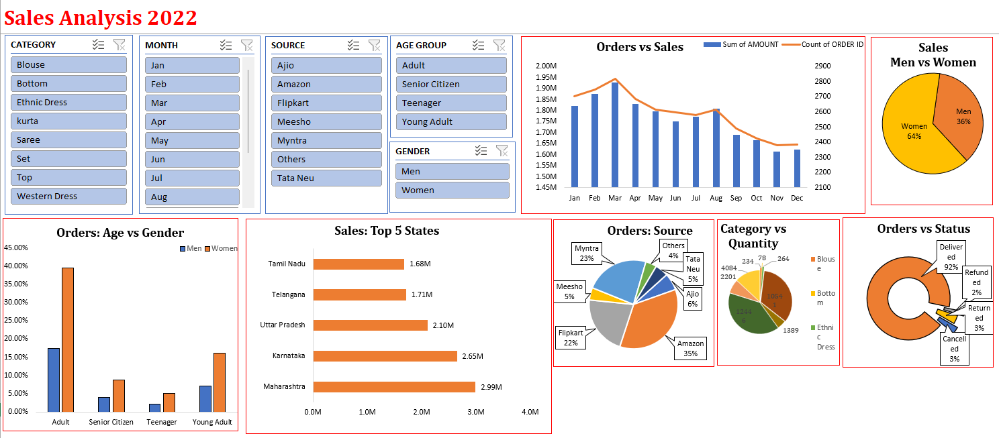

# 🛒 Sales Data Analysis Report 📊

## Overview
This project analyzes *sales data* to extract valuable insights and visualize key trends using *Excel Dashboards*. The dataset contains order details, customer demographics, purchase behaviors, and sales distributions.

## 🔹 Key Insights & Visualizations:
- *Sales Trends:* Monthly sales performance over time.
- *Top 5 Sales States:* Identifying the highest revenue-generating states.
- *Orders Breakdown:* Analysis by gender, age group, and order status.
- *Sales Source Distribution:* Tracking sales from various platforms.
- *Category vs Quantity Sold:* Understanding product demand patterns.

## 📂 Data Columns:
- ORDER ID, CUSTOMER ID, GENDER, AGE, AGE GROUP, PURCHASE DATE, MONTH, STATUS, SOURCE, SKU, CATEGORY, SIZE, QUANTITY, CURRENCY, AMOUNT, SHIPPING CITY, SHIPPING STATE, SHIPPING POSTAL CODE, SHIPPING COUNTRY, B2B

## 📊 Dashboard Preview:

🔗 *Check the full project here:* [https://github.com/Maharana-Vivek]  
📩 Feel free to connect for discussions on *data analysis & visualization*! 🚀  

---
